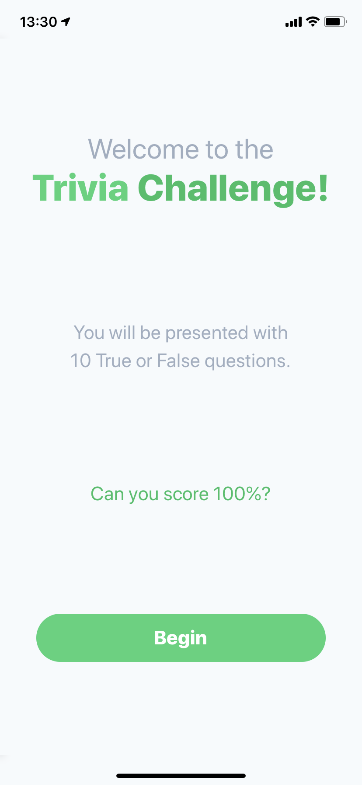
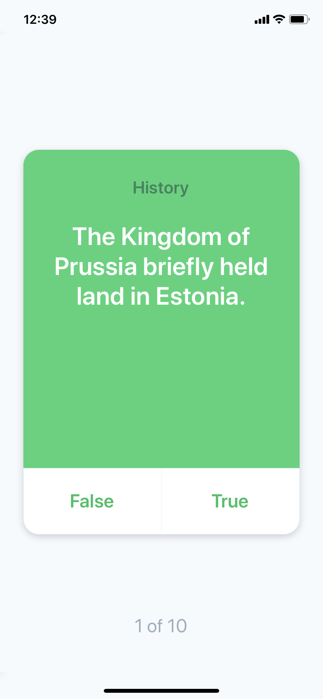
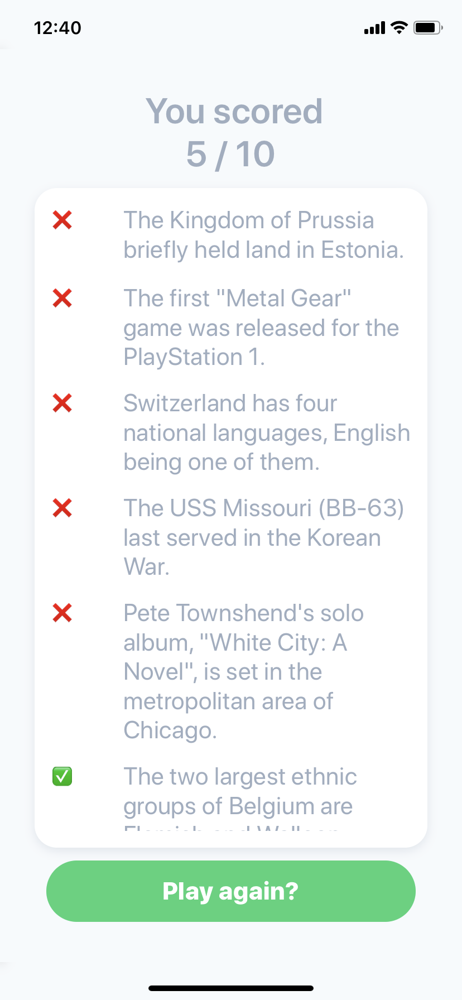

# Trivia App 😋

This is a sample Trivia app developed in React Native as part of an interview process.

This project uses the [Open TDB Api](https://opentdb.com/)

In order to run it, just type:

```
expo start
```





